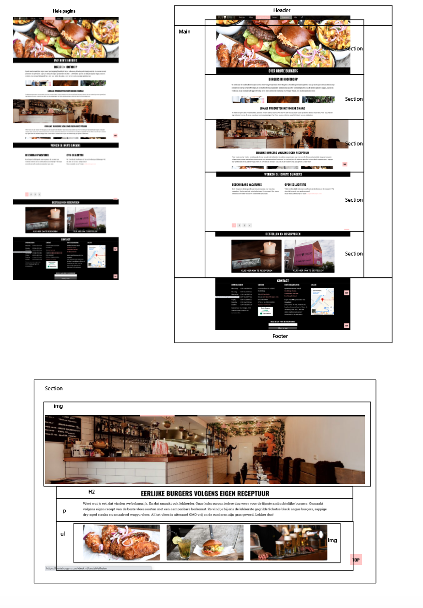

# Procesverslag
**Auteur:** -jouw naam-

Markdown cheat cheet: [Hulp bij het schrijven van Markdown](https://github.com/adam-p/markdown-here/wiki/Markdown-Cheatsheet). Nb. de standaardstructuur en de spartaanse opmaak zijn helemaal prima. Het gaat om de inhoud van je procesverslag. Besteedt de tijd voor pracht en praal aan je website.

## Bronnenlijst
1. https://css-tricks.com/almanac/
2. https://www.bruut.nl/nl/
3. -...-

## Eindgesprek (week 7/8)

-dit ging goed & dit was lastig-

**Screenshot(s):**

-screenshot(s) van je eindresultaat-

## Voortgang 3 (week 6)

-same as voortgang 1-

## Voortgang 2 (week 5)

-same as voortgang 1-

## Voortgang 1 (week 3)

### Stand van zaken

-dit ging goed & dit was lastig-

Ik vond het best lastig om te beginnen. Ik heb mijn leerboek van vorig jaar en het internet weer even moeten raadplegen. Verder willen niet alle afbeeldingen meewerken, en heb ik wat moeite om alle elementen zo mooi als het orgineel te krijgen. Toen ik eenmaal aan de slag ging en weer een beetje door had wat ik aan het doen was ging het coderen wel wat makkelijker.

**Screenshot(s):**

-screenshot(s) van hoe ver je bent-

### Agenda voor meeting

-samen met je groepje opstellen-

### Verslag van meeting

-na afloop snel uitkomsten vastleggen-

## Intake (week 1)

**Je startniveau:** Blauw

**Je focus:** responsive 

**Je opdracht:** - https://www.bruteburgers.com/ -

**Screenshot(s):**

 (images/Bruut2.png)

**Breakdown-schets(en):**

